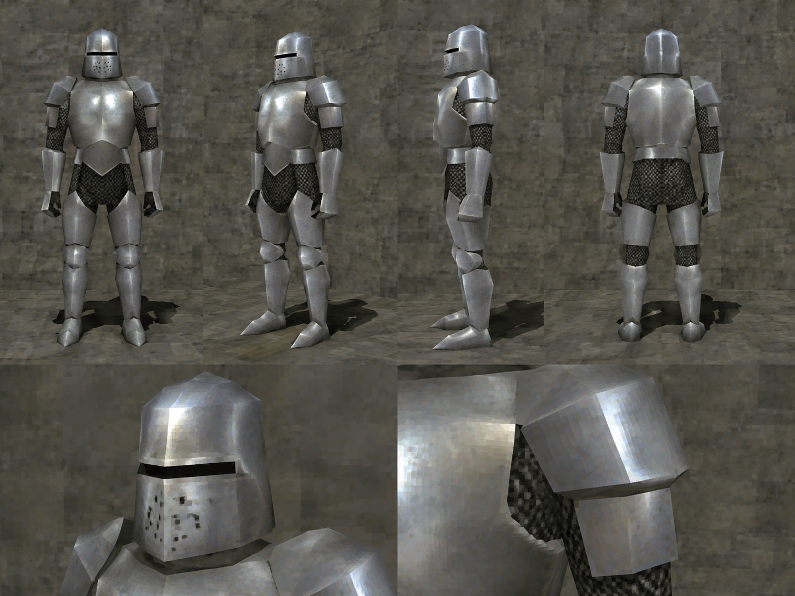

# Knightcore Community Engine

An easy creative tool for making Knightcore-coded PS2 images, memes, scenes, commercials, interstitials, and episodes from an ordinary-language idea.

You do not need prompting knowledge. Tell the Engine what should happen; it handles the locked Anchor Knight, authentic original-PS2 reference grounding, registered visual styles, bloom, camera direction, continuity, approvals, animation prompts, and common repairs.

When you do not name a mood, the Engine begins from luminous medieval dreamcore: whimsical PS2 wonder, open skies, strange beauty, and sincere absurdity. Dark fantasy remains available when you request it.

## What you need

- **ChatGPT with Skills and image generation** for creating pictures in the chat.
- **A separate video tool** for animation. The Engine writes prompts for fal.ai MiniMax H3 Max, Seedance, Kling, or another video tool; it does not render video or include third-party credits.

## Install in ChatGPT

Use [chatgpt.com](https://chatgpt.com) in a browser for installation. The same uploaded Skill can then be used in ChatGPT where personal Skills are supported.

1. Download [knightcore-community-engine.zip](https://github.com/nosimajtechnology/knightcore-community-engine/releases/latest/download/knightcore-community-engine.zip). **Do not unzip it.**
2. Open **Plugins** from the ChatGPT sidebar, then **Skills** → **Create** → **Upload from your computer**.
3. Select the downloaded ZIP and start a new chat.

Start with:

```text
Load the "Knightcore Community Engine" skill.
```

Then describe an idea:

```text
A chrome knight finds a floating silver fruit beside a flowered mountain path and follows it toward the dawn sky.
```

If the first frame is right, reply `Approved.` If one detail is wrong, name only that correction; the Engine preserves everything already passing.

## What you can make

- **CHARACTER** — anchor study, armor variant, or guild member
- **STILL** — one finished image or fake screenshot
- **MEME** — a fast relatable or absurd remix
- **SCENE** — one connected event
- **CLASSIC CINEMATIC** — Genesis Frame, 5–7 shots, then animation brief
- **TAPE / BUMPER** — short ident, loop, or archive fragment
- **COMMERCIAL** — fictional realm product, service, or PSA
- **EPISODE** — four progressive storyboards; a fifth only when needed

## Late-Z and H3 Max

The Engine now includes a broadcast-grounded **Late-Z Battle Cel** style and
the approved Anchor Knight Late-Z sheet. For fal.ai MiniMax H3 Max video:

- **Classic Control / I2V** keeps the approved Genesis Frame as the literal
  opening frame and uses the storyboard as planning authority.
- **Direct Explore / T2V** creates self-contained text-only concepts with no
  references.
- **Character Lock / R2V** places the canonical Anchor Knight sheet first and
  the Late-Z sheet second as style-only authority when active.

## Default Anchor Knight



This reference is the Engine's approved and locked default archetype and raw early-PS2 construction authority. It is not a named mascot, new official character, or declaration of Knightcore lore. The bundled JPEG is preserved unchanged; installation and release automation verify its exact SHA-256 and never regenerate, enhance, crop, or re-encode it.

Different knights, armor wear, capes, props, creatures, settings, moods, and stories are welcome. The Engine does not silently upgrade the Anchor Knight into modern PBR, ornate Soulslike armor, a robot, or a high-poly render.

## Community boundary

Knightcore / $KNIGHT community concept. Community-created outputs are unofficial unless Knightcore says otherwise. Nosimaj Media developed the Engine's production architecture but does not claim ownership of Knightcore, its marks, or third-party game references.

This is a creative-production tool, not a trading tool. It does not introduce token logos, tickers, prices, charts, return promises, or financial advice into ordinary creative work.

Suggested credit:

> Knightcore / $KNIGHT community concept. Community-created scene using the Knightcore Community Engine by Nosimaj Media.

See the [quickstart](./community/quickstart/quickstart.md), [starter templates](./community/remix-templates/starter-templates.md), and [community guide](./community/guidelines/community-guide.md).
